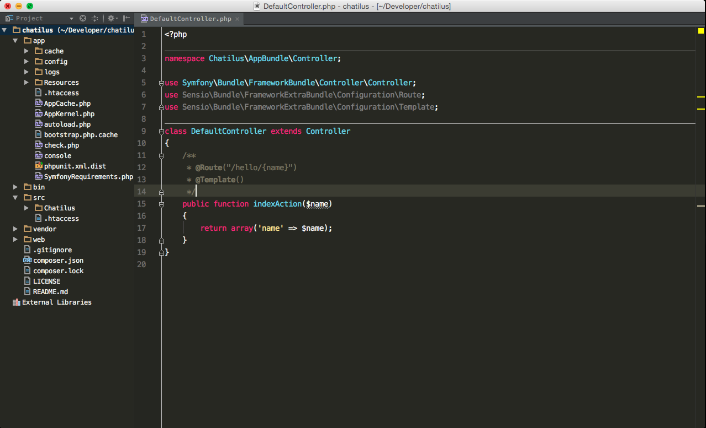

# SublimedPhpStorm

I do love [SublimeText](https://www.sublimetext.com) but [PhpStorm](https://www.jetbrains.com/phpstorm/) is pretty good too. So why not try to have same look and feel on both of these apps.

Unfortunately sidebar still looks bad, couldn't find a solution for it yet.

## How to use

- You can either use settings.jar to import all the settings
- Or you can use keymap.jar and color_scheme.jar 
- To import these jar files go to File->Import Settings

I'm using [Color Ide](https://github.com/dmalch/ColorIde) plugin to change the color of SideBar as stated in [here](https://laracasts.com/series/how-to-be-awesome-in-phpstorm/episodes/1) Which helped me a lot on other things too.

Keymap is originally taken from [here](https://github.com/johannesnagl/phpstorm-sublime-text-keymap) but had to make changes for a similar experience.
Also color scheme is taken from [here](https://github.com/shibby/phpstorm-monokai) with small changes.

So thanks a lot to [@JeffreyWay](https://github.com/JeffreyWay), [@dmalch](https://github.com/dmalch), [@mettbox](https://github.com/mettbox) and [@shibby](https://github.com/shibby)